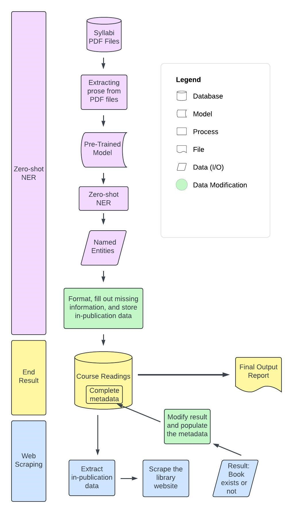

# Computer Science Senior Capstone Project 2024

My project is: Automating Textbook Identification From Course Syllabi and Availability Tracking For Libraries

## Description

This project automates the identification and tracking of required and recommended readings from course syllabi at Earlham College to ensure textbooks are accessible in the Lilly Library. Currently, the process relies on professors notifying the library, which can lead to inconsistencies. This tool uses a large language model (LLM)  to accurately extract textbook information, even from varied formats, and stores this data in a database. Through web scraping, the tool checks book availability in the library catalog, distinguishing between physical and digital copies. This system will help reduce students' financial burden and streamline library resource management, with potential applications for broader academic use in other institutions.

## Flow

This data architecture diagram outlines a pipeline for processing course syllabi to automatically extract and track required and recommended readings. The workflow begins with PDF syllabi files, from which prose is extracted and fed into a pre-trained model that performs zero-shot named entity recognition (NER) to list the reading information. The list then formats each reading and stores it in a central database. To verify availability, a web scraping module queries the library catalog, updating the metadata with availability information. The final output is a report detailing course readings and their availability status, facilitating resource tracking for the library.

{height=40% width=40%}

## How to use the tool

1. Clone this repository
2. Naviagate to the repository directory and create a python virtual environment by running the following command: `python -m venv env`
3. Activate the virtual environment with this command: ` source env/bin/activate`. You can deactivate the environment by running `deactive`.
4. Install the following packages (if they are not already) in the virtual environment using `pip install <package name>`:
    - flask
    - PyPDF2
    - gliner
    - sqlite3
    - isbntools
    - selenium
    - pandas
5. Run the following command to start the program: `python3 app.py` and follow the link or type in the ip address shown on the command line on a web browser.
6. Once the webpage is up, upload the prompted files and select the library website and wait for the report download page to appear.

